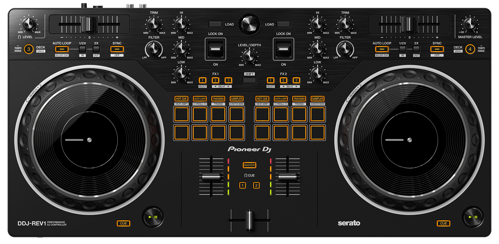
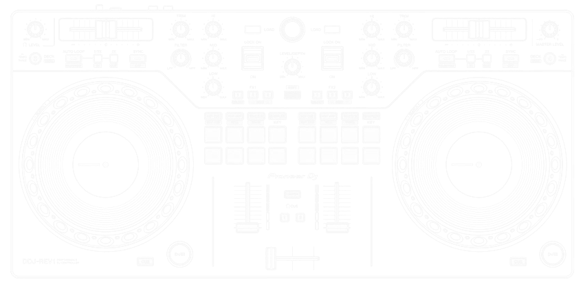

```py
MIXXX VERSION: Windows/Linux Release 2.5.6 - PIONEER DDJ-REV1 Firmware: 1.0
UPDATED 06/2026 - by Uriel Deveaud [AK25 / The Skywatchers / NR] - Languages: EN
```

<!-- NEW MOD PICTURE SWAP -->
<picture>
  <source media="(prefers-color-scheme: dark)" srcset="../images/doc_header_dark.png">
  <source media="(prefers-color-scheme: light)" srcset="../images/doc_header_light.png">
  
</picture>

# Tutorial Serie: Part 1


## Initial Setup

In this section, we are going to look at the pre-requisites and operations needed in order to use the combo DDJ-Rev1/Mixxx. Let´s turn on each component and start by connecting each devices physically. We are using 2 AC plugs as power supply unit, one is for the screen, the other for the mini-pc. Then we are connecting the HDMI plug to the screen and mini-pc and the USB cable for the midi controller. That´s all!

<table>
<tr>
<th align="center", width="880">Advanced Setup</th>
</tr>
</table>

> [!IMPORTANT]
> The first settings to look after is the controller setting interface itself, it is called "Utilities Mode". You can change the following settings in this mode. To enter Utilities mode on the Pioneer DJ DDJ-REV1, disconnect the USB cable from your computer, then plug it back in **while holding down the CUE and PLAY/PAUSE buttons on the left deck**. After any change, you want to wait up to 2sec until it saves the settings, the leds are flashing to indicate its process, don´t unplug before the end of the save setting process or your changes may be lost.

1. Fader Start
2. Back Spin Length
3. Crossfader Cut Lag
4. Demo mode

<!---->
<!-- NEW MOD PICTURE SWAP -->
<picture>
  <source media="(prefers-color-scheme: dark)" srcset="../images/ddjrev1_hardwareGui.png">
  <source media="(prefers-color-scheme: light)" srcset="../images/ddj-rev1_colorBig_v2.png">
  
</picture>


### 1. Fader Start
Press one of the Performance Pads 1 through 3 on the left deck:
- Pad 1 is lit: Fader Start is turned on with Sync mode.
- Pad 2 is lit: Fader Start is turned on without Sync mode (default).
- Pad 3 is lit: Fader Start is turned off.

### 2. Back Spin Length
When using a jog wheel to perform a Back Spin, you can make the Back Spin longer or shorter than the amount you rotate the jog wheel by.
You can set the Back Spin Length to short, normal, or long. Press one of the Performance Pads 5 through 7 on the left deck.
- Pad 5 is lit: Back Spin Length is short.
- Pad 6 is lit: Back Spin Length is normal (default).
- Pad 7 is lit: Back Spin Length is long.

### 3. Crossfader Cut Lag
You can adjust the cut lag (the range where no sound is heard from the relevant deck) at both edges of the crossfader. You can make adjustments with the setting value (1 through 53).
- The default setting value is 8.

Turn the rotary selector (back), then press it. The number of lights that are lit up on the channel level indicators and Performance Pads indicates the setting value (1 through 53).
- The number of lights that are lit up on Performance Pads on the right deck: tens place.
- The sum of the number of lights that are lit up on the channel level indicators on channel 1 and 2: ones place.

E.g. 2 lights on Performance Pads on the right deck, plus 3 lights on channel 1, plus 5 lights on channel 2 means the total value is 28 (20 + 3 + 5 = 28).

### 4. Demo mode
In normal conditions, if you don’t use any features for 10 minutes, the unit will enter Demo mode. When any knob or button on the unit is used during Demo mode, Demo mode is canceled.
Launch Utilities mode and press the [HOT CUE] button on the left deck.
- [HOT CUE] button is lit: Demo mode starts (default).
- [HOT CUE] button is not lit: Demo mode is switched off.

---

<table>
<tr>
<th align="center", width="880">Config files</th>
</tr>
</table>

### Save your audio config file

<table>
<tr>
<th align="center", width="880">Library & Playlists</th>
</tr>
</table>

### Local Music Store

### Metadata

## SQL Database, Backup and Restore

---

## :radio_button: Infos

* Author: **Uriel Deveaud** - [Kore Teknology](https://github.com/KoreTeknology)
* License: This project is released under the GPL License.
* This work is dedicated to all Mixxx users around the world ;)
